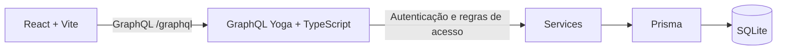

# Financy

Aplicação full stack para organizar finanças pessoais. Cada pessoa cria uma conta, cadastra categorias e registra receitas ou despesas. O dashboard reúne o saldo, os totais do mês e as movimentações recentes. O projeto foi desenvolvido com base no [layout Financy no Figma](https://www.figma.com/design/LSzoaX4lcjOkdxHkadkUeq/Financy--Community-?node-id=3-809).

## Como o projeto funciona

O frontend React envia consultas e mutações GraphQL para a API. A API valida o JWT, identifica o usuário e usa o Prisma para ler ou alterar o banco SQLite. O frontend **não acessa o banco diretamente**.



| Camada | Tecnologias e responsabilidade |
| --- | --- |
| Frontend | React, TypeScript, Vite, React Router, React Query, React Hook Form, Zod e Tailwind CSS. Exibe as telas, valida formulários e mantém os dados em cache por usuário. |
| Backend | TypeScript, GraphQL Yoga, JWT e CORS. Define o schema GraphQL, autentica requisições e aplica as regras de negócio. |
| Persistência | Prisma com SQLite. Guarda usuários, categorias e transações em um arquivo local. |

O repositório mantém as duas aplicações nas pastas `backend/` e `frontend/`, conforme o formato solicitado pelo desafio.

## Funcionalidades e regras

- Cadastro e login com senha armazenada como hash. Um login inválido informa que o e-mail ou a senha estão incorretos, sem indicar qual dos dois falhou.
- Dados privados vinculados ao usuário autenticado: cada pessoa lista e gerencia somente as próprias categorias e transações. Uma transação só pode usar uma categoria da mesma pessoa.
- Criação, edição, exclusão e listagem de categorias e transações. Categorias incluem título, descrição opcional, cor e ícone; transações incluem descrição, valor, tipo (receita ou despesa), data e categoria opcional.
- Dashboard com saldo de todas as transações, receitas e despesas do mês atual, transações recentes e resumo de categorias.
- Lista de transações com busca por descrição, filtros de tipo, categoria e mês, além de paginação no frontend.
- Perfil com edição do nome e saída da conta. O e-mail não pode ser alterado. O fluxo de recuperação de senha ainda não foi implementado.

As relações do banco são `User → Category` e `User → Transaction`. A categoria de uma transação é opcional; ao excluir uma categoria, as transações permanecem cadastradas e ficam sem categoria. As regras de acesso são verificadas na API, não apenas na interface.

## Telas

| Rota | Comportamento |
| --- | --- |
| `/` | Login para visitantes; dashboard para usuários autenticados. |
| `/auth` | Login e criação de conta. |
| `/transactions` | Listagem, filtros e modal para criar ou editar transações. |
| `/categories` | Resumo, listagem e modal para criar ou editar categorias. |
| `/profile` | Dados da conta, edição do nome e saída. |

As rotas de transações, categorias e perfil exigem autenticação. O cadastro e o login retornam um JWT; as demais operações enviam esse token no cabeçalho `Authorization: Bearer ...`. A opção “Lembrar-me” mantém a sessão em `localStorage`; sem ela, o login usa `sessionStorage`.

## Executar localmente

Use a versão de Node.js indicada em `.nvmrc` (atualmente `v24.21.0`). Execute os comandos a partir da raiz do repositório. Backend e frontend precisam ficar em **terminais separados**.

### 1. Backend

```bash
cd backend
npm ci
cp .env.example .env
```

Edite `.env` e substitua `JWT_SECRET` por uma chave própria. O arquivo de exemplo contém todas as variáveis necessárias:

```env
JWT_SECRET=defina_uma_chave_longa_e_secreta
DATABASE_URL="file:./dev.db"
PORT=4000
CORS_ORIGIN=http://localhost:5173
```

Na primeira execução, gere o cliente Prisma e crie as tabelas. Depois, inicie a API:

```bash
npx prisma generate
npx prisma db push
npm run dev
```

A API fica em [http://localhost:4000/graphql](http://localhost:4000/graphql). O SQLite é um **arquivo**, em `backend/prisma/dev.db`; não existe um servidor de banco para iniciar. `npm run dev` sobe apenas a API e não executa `prisma db push` automaticamente.

Se `.env` e o banco já estiverem configurados, basta executar `cd backend` e `npm run dev`.

### 2. Frontend

Em outro terminal:

```bash
cd frontend
npm ci
cp .env.example .env
npm run dev
```

O valor padrão de `VITE_BACKEND_URL` em `.env.example` é `http://localhost:4000/graphql`. Abra [http://localhost:5173](http://localhost:5173) no navegador. Se alterar a porta do frontend, atualize também `CORS_ORIGIN` no backend.

### Visualizar o banco

O Prisma Studio é opcional e usa um processo separado. Dentro de `backend/`, execute:

```bash
npx prisma studio
```

Depois abra [http://localhost:5555](http://localhost:5555). Se a página mostrar “Connection Refused”, confirme que o comando acima continua rodando em um terminal. A porta 5555 é do Studio; a API continua na porta 4000.

## API GraphQL

O schema está em `backend/src/schema.ts`. As operações principais são:

| Tipo | Operações |
| --- | --- |
| Consultas | `me`, `categories`, `transactions` |
| Autenticação e perfil | `signUp`, `signIn`, `updateProfile` |
| Categorias | `createCategory`, `updateCategory`, `deleteCategory` |
| Transações | `createTransaction`, `updateTransaction`, `deleteTransaction` |

`signUp` e `signIn` são públicas. As demais operações exigem um JWT válido. O contexto GraphQL recupera o usuário a partir do token; os serviços filtram consultas por `userId` e verificam a posse antes de editar ou excluir dados. O servidor aceita a origem configurada em `CORS_ORIGIN`.

## Organização do código

```text
backend/
  prisma/schema.prisma       Modelos User, Category e Transaction
  src/server.ts              Servidor GraphQL Yoga e CORS
  src/schema.ts              Tipos, consultas e mutações GraphQL
  src/context.ts             Usuário autenticado em cada requisição
  src/resolvers.ts           Entrada das operações GraphQL
  src/services/             Regras de autenticação e acesso aos dados
  tests/                    Testes do backend
frontend/
  src/App.tsx                Rotas da aplicação
  src/api/graphql.ts         Cliente HTTP GraphQL
  src/providers/            Sessão do usuário
  src/hooks/                Consultas, mutações e cache
  src/components/           Telas, formulários, listas e elementos de UI
  public/                   Logo e ícones usados nas telas
```

## Verificações

Em cada pasta, `npm test` executa os testes e `npm run build` verifica a compilação. O frontend também oferece `npm run lint`.

```bash
cd backend
npm test
npm run build
```

```bash
cd frontend
npm test
npm run lint
npm run build
```

O banco local, os arquivos `.env`, as dependências e as saídas de build não devem ser enviados ao repositório. Para testar o login em uma instalação nova, crie uma conta pela própria tela de cadastro; o projeto não depende de um usuário pré-cadastrado.
