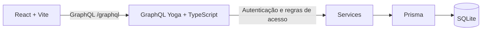
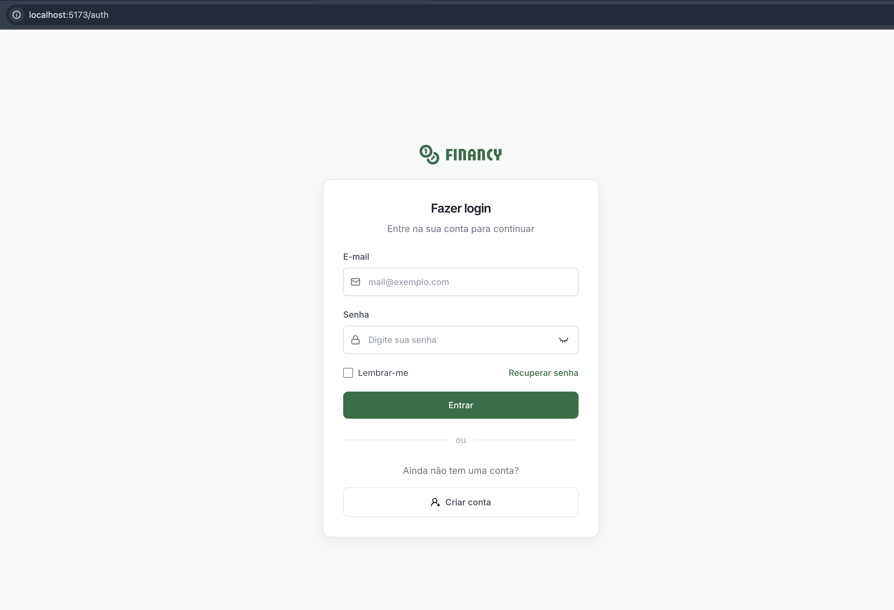
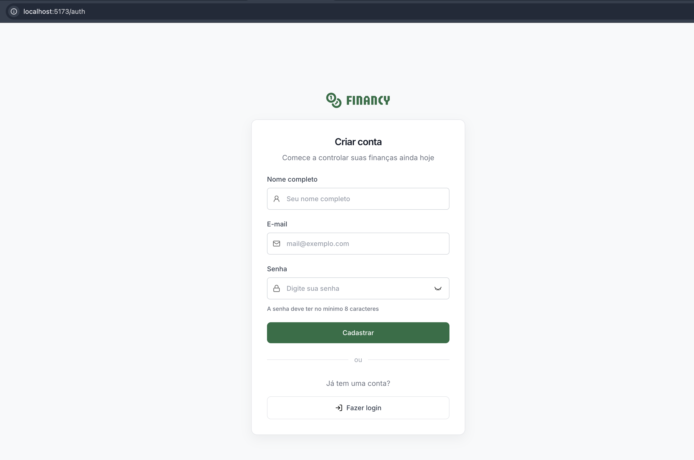
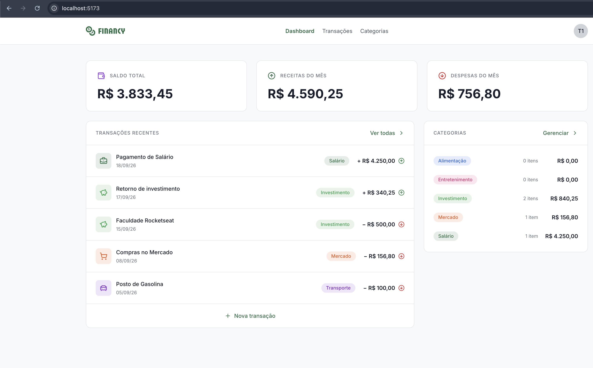
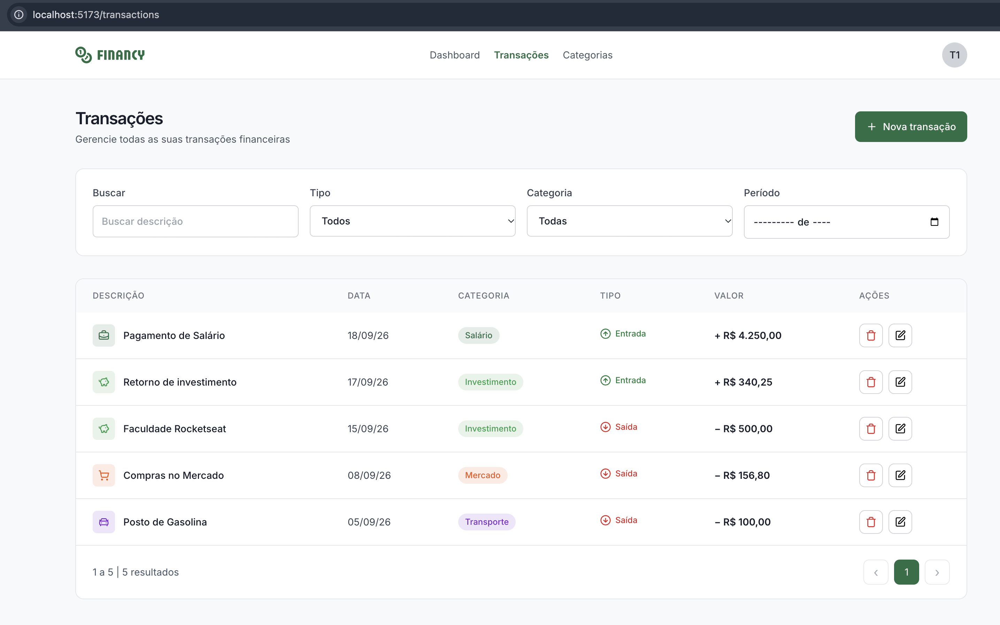
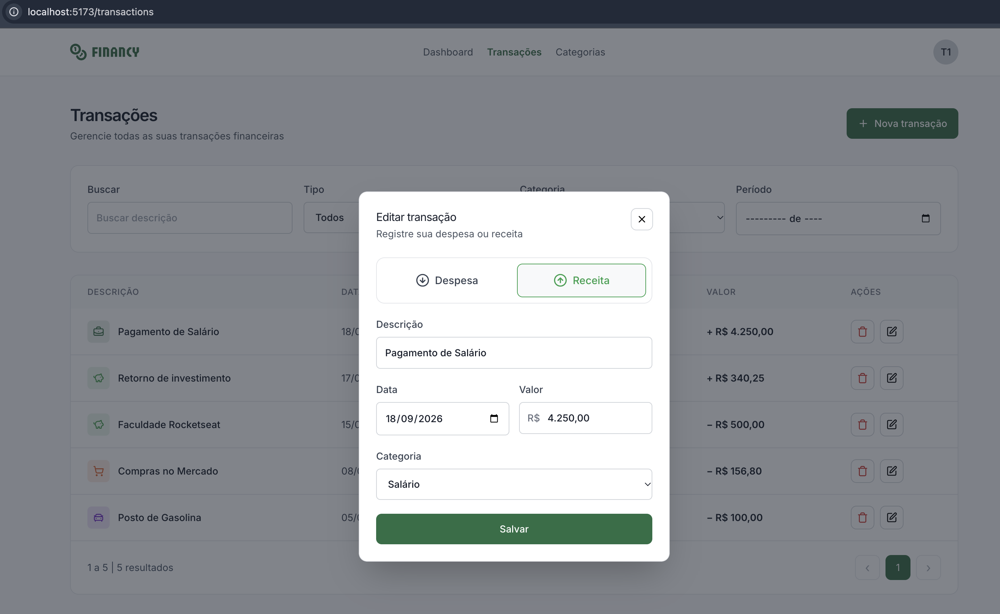
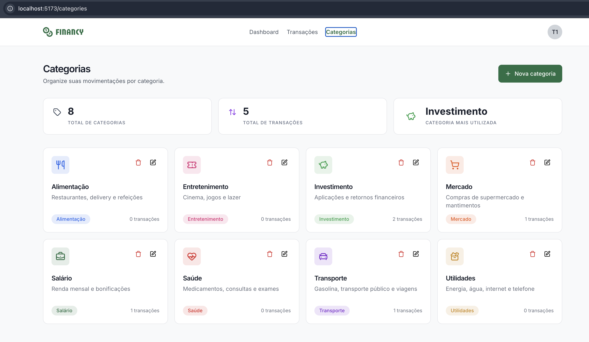
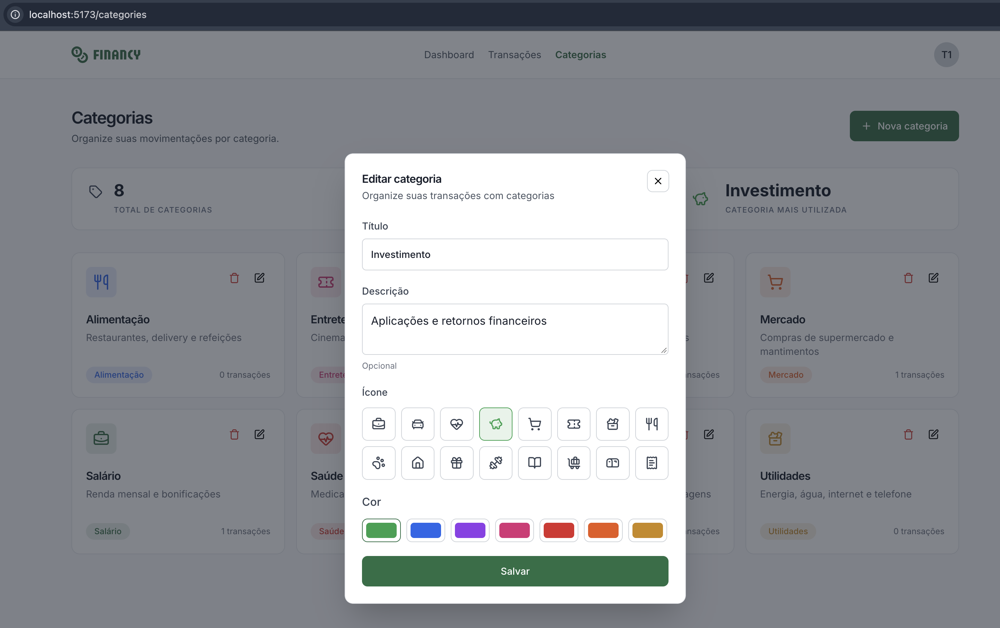
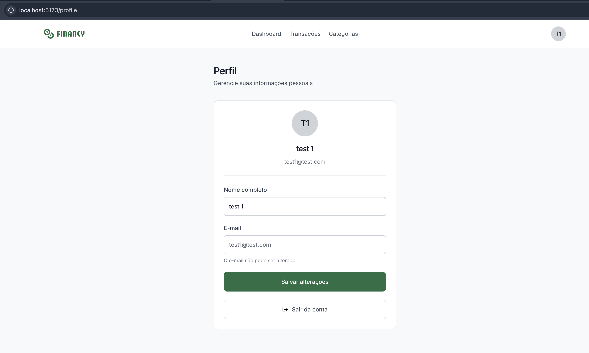

# Financy — Gestão de finanças pessoais


---

O **Financy** é uma aplicação full stack para organizar finanças pessoais, desenvolvida como desafio da pós-graduação **Full-Stack 360º com Inteligência Artificial** da [Rocketseat](https://www.rocketseat.com.br/faculdade). Cada pessoa pode criar uma conta, cadastrar categorias e registrar receitas ou despesas. O dashboard reúne saldo, totais do mês e movimentações recentes.

O projeto segue o [design Financy no Figma](https://www.figma.com/design/LSzoaX4lcjOkdxHkadkUeq/Financy--Community-?node-id=3-809) e mantém as duas aplicações exigidas pelo desafio em pastas independentes: `backend/` e `frontend/`.

## Conteúdo

- [Tecnologias](#tecnologias)
- [Como o projeto funciona](#como-o-projeto-funciona)
- [Funcionalidades e regras](#funcionalidades-e-regras)
- [Telas](#telas)
- [Capturas de tela](#capturas-de-tela)
- [Pré-requisitos](#pré-requisitos)
- [Executar localmente](#executar-localmente)
- [Scripts disponíveis](#scripts-disponíveis)
- [API GraphQL](#api-graphql)
- [Organização do código](#organização-do-código)
- [Testes, cobertura e lint](#testes-cobertura-e-lint)
- [Decisões técnicas e pontos de melhoria](#decisões-técnicas-e-pontos-de-melhoria)
- [Problemas comuns](#problemas-comuns)
- [Entrega](#entrega)
- [Referências e licença](#referências-e-licença)

## Tecnologias

| Área | Ferramentas | Papel no projeto |
| --- | --- | --- |
| Backend | Node.js, TypeScript, GraphQL Yoga, JWT, bcryptjs | API GraphQL, autenticação e regras de acesso. |
| Persistência | Prisma ORM, SQLite | Modelagem e armazenamento local em arquivo. |
| Frontend | React, TypeScript, Vite, React Router | Interface e navegação sem framework SSR. |
| Dados e formulários | TanStack Query, React Hook Form, Zod | Cache, mutações e validação de entrada. |
| Interface | Tailwind CSS, componentes próprios | Layout responsivo baseado no Figma. |
| Qualidade | Vitest, Testing Library, Oxlint | Testes automatizados, cobertura e lint do frontend. |

O projeto usa **GraphQL** para todas as consultas e alterações feitas pelo frontend. **Docker não é necessário**: o SQLite persiste os dados em um arquivo local.

## Como o projeto funciona

O frontend React envia consultas e mutações GraphQL para a API. A API valida o JWT, identifica o usuário e usa o Prisma para ler ou alterar o banco SQLite. O frontend **não acessa o banco diretamente**.



O frontend mantém consultas em cache por usuário. Os resolvers encaminham as operações aos serviços, responsáveis pela validação e pelas regras de propriedade antes de acessar o Prisma.

## Funcionalidades e regras

| Área | O que a pessoa pode fazer |
| --- | --- |
| Conta | Criar conta, entrar com e-mail e senha, manter a sessão e sair. Um login inválido recebe mensagem amigável. |
| Dashboard | Consultar saldo acumulado, receitas e despesas do mês, últimas cinco transações e resumo das categorias. |
| Transações | Criar, listar, buscar, filtrar por tipo/categoria/mês, paginar, editar e excluir receitas ou despesas. O valor é digitado e exibido em reais. |
| Categorias | Criar, listar, editar e excluir categorias com título, descrição opcional, cor e ícone. Consultar totais e categoria mais utilizada. |
| Perfil | Consultar nome e e-mail e alterar o nome. |

As relações do banco são `User → Category` e `User → Transaction`. A categoria de uma transação é opcional; ao excluir uma categoria, as transações permanecem cadastradas e ficam sem categoria. A senha é armazenada como hash, e o e-mail do perfil não pode ser alterado. A recuperação de senha ainda não foi implementada.

O backend exige autenticação para consultas e alterações de dados privados. Categorias e transações são associadas ao `userId` do token validado, e a API verifica a propriedade antes de editar, excluir ou associar uma categoria a uma transação. As transações aceitam apenas valor positivo e os tipos `INCOME` (receita) ou `EXPENSE` (despesa). O saldo é a soma das receitas menos a soma das despesas; os cartões mensais usam o mês corrente. A data da transação é tratada como data de calendário para evitar deslocamento de mês por fuso horário.

### Experiência na interface

- Formulários de cadastro, login, categoria e transação com validação e mensagens em português.
- Valores apresentados em reais, datas no formato brasileiro e cores/ícones associados às categorias.
- Estados de carregamento, listas vazias e mensagens de erro para orientar as operações.
- Navegação responsiva e modais para criar ou editar categorias e transações.

## Telas

| Rota | Comportamento |
| --- | --- |
| `/` | Login para visitantes; dashboard para usuários autenticados. |
| `/auth` | Login e criação de conta. |
| `/transactions` | Listagem, filtros e modal para criar ou editar transações. |
| `/categories` | Resumo, listagem e modal para criar ou editar categorias. |
| `/profile` | Dados da conta, edição do nome e saída. |

As rotas de transações, categorias e perfil exigem autenticação. O cadastro e o login retornam um JWT; as demais operações enviam esse token no cabeçalho `Authorization: Bearer ...`. A opção “Lembrar-me” mantém a sessão em `localStorage`; sem ela, o login usa `sessionStorage`.

Login e cadastro são dois estados do mesmo formulário. Há dois diálogos principais: formulário de transação e formulário de categoria, usados tanto para criar quanto para editar.

## Capturas de tela

As imagens abaixo mostram o Financy em execução local com dados de teste. Os valores exibidos representam o momento das capturas e podem mudar conforme as transações cadastradas.

### Acesso à conta

| Login | Criar conta |
| :---: | :---: |
|  |  |

### Dashboard



### Transações

| Listagem e filtros | Editar transação |
| :---: | :---: |
|  |  |

### Categorias

| Resumo e categorias cadastradas | Editar categoria |
| :---: | :---: |
|  |  |

### Perfil



## Pré-requisitos

- **Node.js 24.21.0**, versão indicada em [`.nvmrc`](.nvmrc), e npm. Com nvm, execute `nvm use` na raiz.
- **Git**, para clonar o repositório.
- **Dois terminais**, um para a API e outro para o frontend.

Não é preciso instalar SQLite, PostgreSQL ou Docker para executar esta configuração. O Prisma cria e acessa o banco SQLite em um arquivo local.

## Executar localmente

Clone o repositório e entre na pasta do projeto:

```bash
git clone https://github.com/avcneto/ftr-pos360-financy.git
cd ftr-pos360-financy
```

Os passos a seguir começam na raiz do repositório. Mantenha backend e frontend em **terminais separados**. Se você já tiver o código localmente, comece pela configuração do backend.

### 1. Backend

```bash
cd backend
npm ci
npm run dev
```

Na primeira execução, o script cria `.env` a partir de `.env.example`, gera um `JWT_SECRET` aleatório e prepara o SQLite. Se `.env` já existir, ele é preservado para não sobrescrever suas configurações.

| Variável | Configuração local inicial |
| --- | --- |
| `JWT_SECRET` | Gerado automaticamente no primeiro início. |
| `DATABASE_URL` | `file:./dev.db`, definido em `.env.example`. |
| `PORT` | `4000`, definido em `.env.example`. |
| `CORS_ORIGIN` | `http://localhost:5173`, definido em `.env.example`. |

Você pode editar `.env` depois, se precisar de outra porta, origem ou banco. O arquivo não é enviado ao Git. Se já existir um `.env` criado manualmente com o valor de exemplo para `JWT_SECRET`, substitua esse valor por uma chave própria.

A API fica em [http://localhost:4000/graphql](http://localhost:4000/graphql). O SQLite é um **arquivo**, em `backend/prisma/dev.db`; não existe um servidor de banco para iniciar. A cada início, `npm run dev` executa `prisma db push --skip-generate` para criar ou sincronizar as tabelas sem apagar os dados existentes. A opção `--skip-generate` evita regravar o Prisma Client e acionar trabalho desnecessário de indexação no editor em todas as inicializações. Se uma alteração do schema exigir perda de dados, o Prisma interrompe a operação para revisão. Após alterar `prisma/schema.prisma`, execute `npm run db:generate` e reinicie `npm run dev`.

Em execuções posteriores, basta executar `npm run dev` dentro de `backend/`.

### 2. Frontend

Em outro terminal:

```bash
cd frontend
npm ci
npm run dev
```

O frontend usa `http://localhost:4000/graphql` por padrão e não precisa de `.env` para a execução local. Se a API estiver em outro endereço, crie `frontend/.env` a partir de `.env.example` e ajuste `VITE_BACKEND_URL`. Abra [http://localhost:5173](http://localhost:5173) no navegador. Se alterar a porta do frontend, atualize também `CORS_ORIGIN` no backend.

> **Primeiro acesso:** use **Criar conta** na tela de login. Não há usuário de teste nem senha pré-cadastrados.

### Visualizar o banco

O Prisma Studio é opcional e usa um processo separado. Dentro de `backend/`, execute:

```bash
npx prisma studio
```

Depois abra [http://localhost:5555](http://localhost:5555). Se a página mostrar “Connection Refused”, confirme que o comando acima continua rodando em um terminal. A porta 5555 é do Studio; a API continua na porta 4000.

## Scripts disponíveis

| Pasta | Comando | O que faz |
| --- | --- | --- |
| `backend/` | `npm run dev` | Prepara o SQLite e inicia a API com reinício automático ao alterar o código. |
| `backend/` | `npm run env:setup` | Cria `.env` com segredo aleatório, somente se ainda não existir. |
| `backend/` | `npm run db:setup` | Garante o `.env` e sincroniza o schema do Prisma sem regenerar o cliente. |
| `backend/` | `npm run db:generate` | Regenera o Prisma Client após alterações em `prisma/schema.prisma`. |
| `backend/` | `npm run build` | Compila o TypeScript. |
| `backend/` | `npm start` | Executa o servidor compilado. Rode `npm run build` antes. |
| `backend/` | `npm test` / `npm run test:watch` | Executa os testes uma vez / em modo de observação. |
| `frontend/` | `npm run dev` | Inicia o Vite em desenvolvimento. |
| `frontend/` | `npm run build` / `npm run preview` | Gera o build de produção / abre a prévia do build. |
| `frontend/` | `npm run lint` | Executa o Oxlint. |
| `frontend/` | `npm test` / `npm run test:watch` | Executa os testes uma vez / em modo de observação. |

`npm run dev` chama `db:setup` automaticamente. A sincronização usa `--skip-generate` para reduzir o trabalho na inicialização; use `npm run db:generate` somente após alterar o schema do Prisma. O Prisma Studio continua sendo opcional e é iniciado separadamente com `npx prisma studio` dentro de `backend/`.

## API GraphQL

O schema está em `backend/src/schema.ts`. As operações principais são:

`signUp` e `signIn` são públicas. As demais operações exigem um JWT válido. O contexto GraphQL recupera o usuário a partir do token; os serviços filtram consultas por `userId` e verificam a posse antes de editar ou excluir dados. O servidor aceita a origem configurada em `CORS_ORIGIN`.

`transactionsPage` recebe `page` e `pageSize` (de 1 a 100) e aceita `search`, `type`, `categoryId` e `month` (`AAAA-MM`). Retorna `items`, `total` e a página efetivamente usada; a tela usa esses dados para mostrar o intervalo de resultados e navegar entre páginas. A consulta `transactions` continua disponível para obter a lista completa, usada nos resumos.

| Operação | Acesso | Finalidade |
| --- | --- | --- |
| `signUp`, `signIn` | Público | Cadastro e autenticação; retornam JWT e usuário. |
| `me`, `updateProfile` | JWT | Consultar a conta e alterar o nome. |
| `categories`, `createCategory`, `updateCategory`, `deleteCategory` | JWT | Listar e gerenciar categorias próprias. |
| `transactions`, `transactionsPage` | JWT | Consultar transações próprias, com ou sem paginação. |
| `createTransaction`, `updateTransaction`, `deleteTransaction` | JWT | Gerenciar receitas e despesas próprias. |

### Exemplos de operações

Crie uma conta ou entre com uma já cadastrada. Não há usuário de teste criado automaticamente.

```graphql
mutation CriarConta {
  signUp(name: "Pessoa Exemplo", email: "pessoa@example.com", password: "senha-segura-123") {
    token
    user { id name email }
  }
}
```

```graphql
mutation Entrar {
  signIn(email: "pessoa@example.com", password: "senha-segura-123") {
    token
    user { id name email }
  }
}
```

Nas próximas operações, envie o token retornado no cabeçalho `Authorization: Bearer SEU_TOKEN`. Por exemplo:

```graphql
query ListarTransacoes {
  transactionsPage(page: 1, pageSize: 10, month: "2026-09") {
    total
    page
    items {
      id
      title
      amount
      type
      date
      category { id title color icon }
    }
  }
}
```

Para cadastrar uma categoria e vinculá-la a uma despesa, use o `id` retornado na primeira mutação:

```graphql
mutation CriarCategoria {
  createCategory(title: "Alimentação", color: "#2563eb", icon: "utensils") {
    id
    title
    color
    icon
  }
}
```

```graphql
mutation CriarDespesa($categoryId: ID) {
  createTransaction(
    title: "Almoço"
    amount: 89.5
    type: "EXPENSE"
    date: "2026-09-27"
    categoryId: $categoryId
  ) {
    id
    title
    amount
    category { title }
  }
}
```

No exemplo da despesa, envie `{"categoryId":"ID_DA_CATEGORIA"}` como variáveis GraphQL. A API recusa o vínculo se a categoria pertencer a outra pessoa.

O schema completo está em `backend/src/schema.ts`. A data enviada nos formulários usa `AAAA-MM-DD`; a interface exibe datas em formato brasileiro. Para consultar todas as operações disponíveis, abra o endpoint GraphQL com a API em execução.

## Organização do código

```text
.
├── backend/
│   ├── prisma/schema.prisma    # Modelos User, Category e Transaction
│   ├── src/
│   │   ├── server.ts           # Servidor GraphQL Yoga e CORS
│   │   ├── schema.ts           # Tipos, consultas e mutações GraphQL
│   │   ├── context.ts          # Usuário autenticado por requisição
│   │   ├── resolvers.ts        # Entrada das operações GraphQL
│   │   └── services/           # Regras de negócio e acesso aos dados
│   ├── tests/                 # Testes do backend
│   ├── scripts/ensure-env.mjs # Configuração inicial do .env
│   └── .env.example           # Variáveis necessárias à API
├── frontend/
│   ├── public/                # Logo e ícones usados nas telas
│   ├── src/
│   │   ├── App.tsx             # Rotas e proteção das páginas
│   │   ├── api/graphql.ts      # Cliente HTTP GraphQL
│   │   ├── providers/          # Sessão do usuário
│   │   ├── hooks/              # Consultas, mutações e cache
│   │   └── components/         # Páginas, formulários, listas e UI
│   └── .env.example           # URL da API para o Vite
├── docs/                      # Capturas de tela da aplicação em execução
├── .nvmrc                     # Versão recomendada do Node.js
├── LICENSE                    # Licença MIT
└── README.md
```

Os componentes de interface reutilizáveis ficam em `frontend/src/components/ui/`. As páginas coordenam hooks e diálogos; os hooks concentram as operações GraphQL e a invalidação do cache do React Query. No backend, `resolvers.ts` recebe as operações, enquanto `services/` concentra as consultas Prisma e as verificações de propriedade.

## Testes, cobertura e lint

Em cada pasta, `npm test` executa os testes com Vitest e `npm run build` verifica a compilação. O frontend também oferece `npm run lint` com Oxlint.

```bash
cd backend
npm test
npm run build
```

```bash
cd frontend
npm test
npm run lint
npm run build
```

### Cobertura medida

Medição local em **27/09/2026**, com o provedor V8 do Vitest e inclusão dos arquivos TypeScript/TSX de `src/`. Os percentuais são uma fotografia do código nesta data, não uma garantia de ausência de defeitos nem uma medição de testes de ponta a ponta.

| Aplicação | Testes | Statements | Branches | Functions | Lines |
| --- | ---: | ---: | ---: | ---: | ---: |
| Backend | 50 | **97,88%** (139/142) | 92,22% (83/90) | 100% (39/39) | 100% (131/131) |
| Frontend | 69 | **89,05%** (488/548) | 81,18% (371/457) | 85,53% (136/159) | 92,76% (449/484) |

Para reproduzir a medição e gerar `coverage/coverage-summary.json` em cada aplicação:

```bash
cd backend
npm test -- --coverage --coverage.include='src/**/*.ts' --coverage.reporter=text --coverage.reporter=json-summary
```

```bash
cd frontend
npm test -- --coverage --coverage.include='src/**/*.{ts,tsx}' --coverage.exclude='src/**/*.test.{ts,tsx}' --coverage.exclude='src/test/**' --coverage.reporter=text --coverage.reporter=json-summary
```

Arquivos de teste, CSS, imagens e tipos sem código executável não compõem esses percentuais. Os relatórios em `coverage/` são ignorados pelo Git. Em caso de mudanças no código, execute os comandos novamente antes de atualizar os números acima.

### Resultado do lint

O lint do frontend terminou com **0 erros e 0 avisos**. Os formulários usam `useWatch` para acompanhar campos, os arquivos de componentes exportam apenas componentes e os efeitos de autenticação e perfil não fazem atualizações síncronas de estado. Não há script de lint configurado para o backend. O build TypeScript passou nas duas aplicações; `noUnusedLocals` e `noUnusedParameters` estão habilitados no frontend, mas não no backend. Essas opções não detectam exports e arquivos usados somente por testes.

## Decisões técnicas e pontos de melhoria

O projeto já separa API, persistência, hooks, páginas, formulários e componentes básicos. `Button`, `Dialog`, `FormField` e `Surface` são compartilhados, enquanto os serviços do backend impõem as regras de acesso independentemente da interface. Isso atende aos requisitos principais do desafio e deixa as responsabilidades centrais identificáveis.

Na revisão de manutenção, ficaram estes pontos para uma próxima refatoração:

1. `AuthForm.tsx` e `TransactionForm.tsx` concentram apresentação, estado e tratamento de entrada. O campo de moeda e partes comuns do formulário podem ser extraídos para arquivos menores com responsabilidades mais claras.
2. `useDashboardSummary.ts` repete consultas GraphQL e a criação de transação já implementadas em `useCategories.ts` e `useTransactions.ts`. Reaproveitar os hooks ou as operações GraphQL reduziria duplicação sem mudar a interface.
3. A aparência das etiquetas de categoria é reproduzida em listas e no dashboard; um componente visual compartilhado pode manter cores e espaçamento consistentes.
4. `TransactionMetrics.tsx` não é usado pela aplicação atual, pois os três cartões foram removidos da tela de transações. `formatDate` também não é usado fora dos testes. Os arquivos de exemplo `hero.png`, `react.svg` e `vite.svg` não têm referências no produto. Eles podem ser removidos após confirmar que não serão reaproveitados.
5. A ausência de lint no backend ainda é uma melhoria de qualidade aberta. O projeto não possui testes de navegador que comparem as telas com o Figma; a cobertura apresentada mede execução de código, não fidelidade visual.

## Problemas comuns

| Sintoma | Verificação |
| --- | --- |
| `EADDRINUSE` na porta 4000 | Execute `lsof -i :4000` para identificar o processo. Encerre a instância anterior ou altere `PORT` e ajuste `VITE_BACKEND_URL`. |
| Erro de conexão com a API | Confirme que backend e frontend estão rodando, que `VITE_BACKEND_URL` aponta para `/graphql` e que `CORS_ORIGIN` permite a origem do frontend. |
| Erro de CORS no navegador | Confira a origem exata do Vite, incluindo a porta, em `CORS_ORIGIN`. Reinicie a API após alterar `.env`. |
| Tabelas ainda não existem | Confira `DATABASE_URL` e execute `npm run db:setup` em `backend/`. `npm run dev` também executa essa preparação antes de iniciar a API. |
| Prisma Studio não abre na porta 5555 | Rode `npx prisma studio` em outro terminal; `npm run dev` inicia a API, não o Studio. |
| Dados sumiram ou aparecem em outro banco | Confira `DATABASE_URL` no `.env` do backend. O SQLite usa o arquivo apontado por essa variável; reiniciar a API não apaga os dados. |
| Login recusado em instalação nova | Crie uma conta na tela de cadastro. O projeto não inclui seed de usuários e senhas não podem ser consultadas em texto puro. |
| Mudanças no frontend não aparecem | Confirme que o Vite está em execução na porta mostrada no terminal e recarregue a página. |

## Entrega

O desafio solicita um repositório GitHub **público** com `backend/` e `frontend/` na raiz. Antes de enviar o link à plataforma, confirme a visibilidade do repositório e execute testes e builds nas duas pastas. Funcionalidades opcionais, como upload de avatar e recuperação de senha, não fazem parte da implementação atual.

O banco local, os arquivos `.env`, as dependências e as saídas de build não devem ser enviados ao repositório. Para testar o login em uma instalação nova, crie uma conta pela própria tela de cadastro; o projeto não depende de um usuário pré-cadastrado.

## Referências e licença

- [Design Financy no Figma](https://www.figma.com/design/LSzoaX4lcjOkdxHkadkUeq/Financy--Community-?node-id=3-809).
- [Rocketseat — Faculdade](https://www.rocketseat.com.br/faculdade).
- [Código-fonte no GitHub](https://github.com/avcneto/ftr-pos360-financy).

O repositório contém uma [licença MIT](LICENSE). Para dúvidas ou sugestões sobre o projeto, use o [perfil @avcneto no GitHub](https://github.com/avcneto).

---

Desenvolvido por [Anderson Neto](https://github.com/avcneto) · Pós-graduação Full-Stack 360º com Inteligência Artificial
